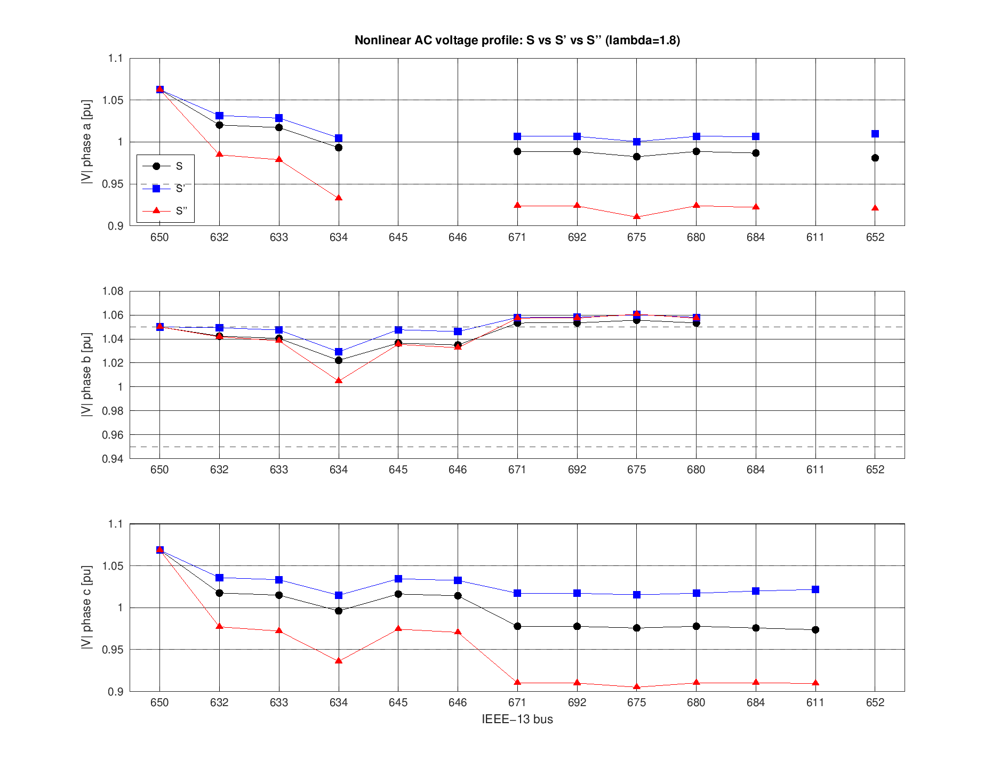
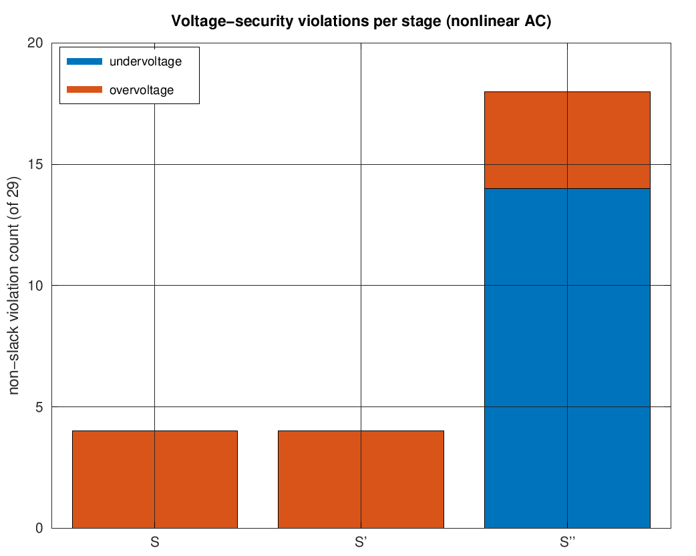
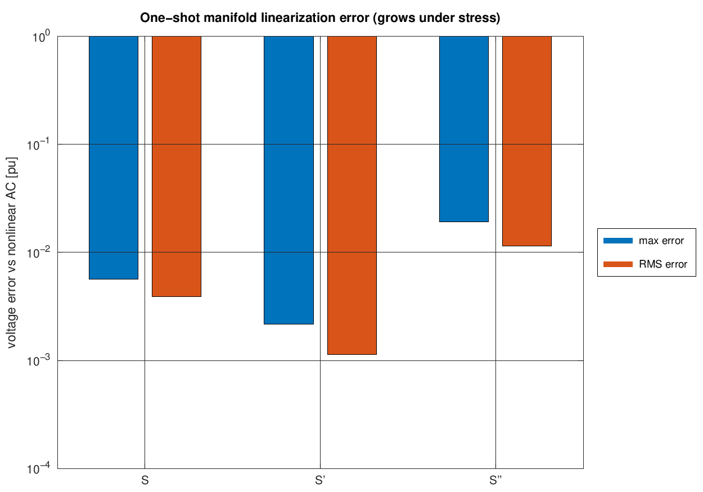
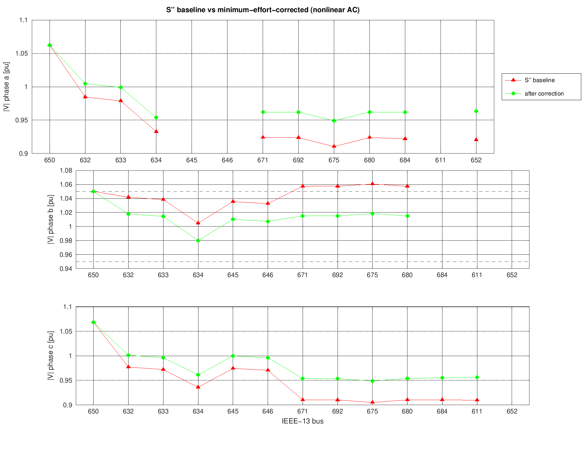
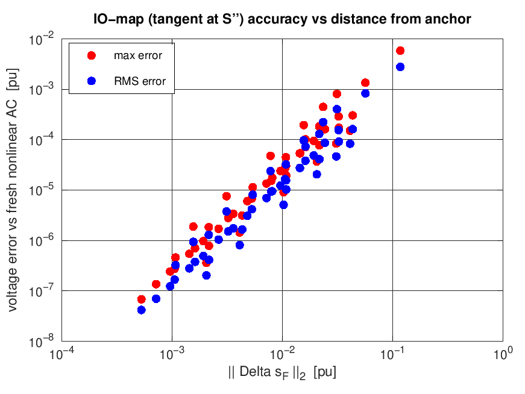

# A DSO-Side Physical Pipeline for the IEEE-13 Feeder: Construction, Validation, and the Local Voltage-Security Interface

## Abstract

We construct a clean, three-stage physical pipeline on the IEEE-13 three-phase
unbalanced test feeder,
$$
\mathcal S \;\rightarrow\; \mathcal S' \;\rightarrow\; \mathcal S'',
$$
progressing from the original benchmark to an active distribution system with
inverter-based DER at four future energy-community (EC) nodes, to an active
and congested system under a $\lambda=1.8$ load-stress factor. At every stage
we solve the Bolognani–Dörfler (1ACPF) tangent-plane manifold linearization
and independently validate against a custom Newton–Raphson nonlinear
three-phase AC solver. From the fully validated $\mathcal S''$ operating
point we derive the local input–output sensitivity map, the grid-wide
voltage-security constraint, and its projection onto the four EC
participants, $A_{F,sh}\Delta s_F \le b_{F,sh}$. We then run a pure
feasibility/minimum-effort analysis of that constraint (no game-theoretic
objective yet) and re-validate the resulting corrective dispatch in the
nonlinear AC model, and separately quantify how the linearization error of
the interface itself grows with distance from the $\mathcal S''$ anchor.
Two methodological findings are reported in detail because each changed a
concrete result, and both were caught only by cross-checking against
independent ground truth rather than trusting internally-consistent-looking
code: (1) the DSO interface's row-side data (which rows are violated, by
how much) must be anchored at the nonlinear AC-converged operating point,
not the fast one-shot manifold estimate — an anchoring bug plus a spurious
RHS term together corrupted the exported constraint's right-hand side by
$\|b_{wrong}-b_{correct}\|_\infty=0.178$ p.u. (isolating the RHS-formula
bug alone, at the correct anchor: 0.195 p.u.); and (2) the interface's
column-side data (which of the 14 numbers in $x_F$ means what) was
independently re-derived, inconsistently, in three downstream scripts —
9 of 14 columns were mislabeled/misapplied relative to what
`derive_shared_constraint.m` actually built, silently halving the
effectiveness of every corrective dispatch computed before the fix. Both
are now fixed, backed by hard invariant/consistency checks built into the
pipeline that would fail loudly if either regressed.

## 1. Motivation

The end goal (outside the scope of this report) is a generalized Nash
equilibrium game among four flexible energy-community participants,
constrained by the distribution network's voltage-security limits. Before
any game-theoretic formulation is introduced, the DSO side of that
interface needs to be established on its own: a physically meaningful,
independently validated operating point, from which a *local* network
constraint is derived and handed to the community layer. This report covers
exactly that DSO-side construction — nothing about player objectives, cost
structure, or equilibrium selection is addressed here.

## 2. Method

### 2.1 The Bolognani–Dörfler / 1ACPF manifold

The repository's existing machinery (`Nmatrix.m`, `Rmatrix.m`, `bracket.m`,
`rw.m`) implements the implicit linearization of the power-flow manifold
from Bolognani & Dörfler (Allerton 2015). Two forms of this linearization
are used, for two different purposes:

- **One-shot / flat-anchored** (`bd_linear_solve.m`): the original paper's
  method — a *single* linear solve, without iteration, using the flat/
  no-load reference voltage as the linearization point. This is the "fast"
  manifold solve; we use it at every stage purely to obtain a quick
  approximate operating point $x^\star$ and to measure how much error that
  approximation carries relative to the true nonlinear solution.
- **General / arbitrary-point** (`bd_tangent_general.m`): the same
  underlying tangent-plane construction, generalized to linearize around
  *any* point $(v^\star,\theta^\star)$ on or near the manifold:
$$
A_{x^\star} = \big[\,M(u^\star)R(u^\star),\; I\,\big],\qquad
M(u^\star)=\langle \mathrm{diag}(\overline{Yu^\star})\rangle + \langle
\mathrm{diag}(u^\star)\rangle N\langle Y\rangle,
$$
  where $\langle\cdot\rangle$ is the real-imaginary bracket operator, $N$
  the sign-flip operator on the $[v;\theta]$/$[p;q]$ split, and
  $R(v,\theta)$ the polar-to-rectangular rotation. This is the form that
  produces the final DSO-to-community interface, evaluated at the nonlinear
  AC operating point of $\mathcal S''$ (Section 5).

### 2.2 Nonlinear AC ground truth

No solver for unbalanced three-phase nonlinear AC power flow existed in
this repository (MATPOWER, used elsewhere in the codebase, is
positive-sequence/balanced only). `solve_acpf_3ph_rect.m` is a
purpose-built Newton–Raphson solver in rectangular coordinates, operating
directly on the same multiphase admittance matrix $Y$ built by `ieee13.m`,
used identically at every stage as the independent validation reference.
It converges in 3–4 Newton iterations to a mismatch below $10^{-12}$ p.u.
in every case reported here.

### 2.3 Physical connectivity mask

The original feeder mixes fully three-phase and partially connected
buses. Because `ieee13.m`'s admittance matrix regularizes missing phases
with a nonzero dummy self-impedance (needed to keep $Y$ invertible even on
laterals with no physical conductor on some phase), the true missing-phase
structure is *not* recoverable from $Y$ alone. It is instead taken from the
NaN pattern of the benchmark's own published solution table (Kersting), a
single source of truth reused at every stage since topology and phase
connectivity never change across $\mathcal S,\mathcal S',\mathcal S''$: 29
of 36 non-slack bus-phase terminals are physically connected.

## 3. Stage definitions

### 3.1 $\mathcal S$ — original benchmark (unmodified)

Exactly as provided: same topology, loads, capacitor banks, slack
conditions, and voltage limits ($0.95\le|V|\le1.05$ p.u.) as the published
IEEE-13 feeder. No modification.

### 3.2 $\mathcal S'$ — active distribution system (+DER)

Inverter-based DER is added at the four future EC nodes — **645, 611, 652,
671** — using the additive, minimal-modification convention
$$
P_i^{\text{net}} = P_i^{\text{load}} - P_i^{\text{DER}}, \qquad
Q_i^{\text{net}} = Q_i^{\text{load}} \;\;(\,Q^{\text{DER}}=0\,),
$$
i.e. unity-power-factor inverters placed *alongside* the existing load
rather than replacing it, so no other part of the feeder is touched. DER is
placed only on bus-phases already physically connected *and* already
carrying load (645: phases b, c; 611: phase c; 652: phase a; 671: phases
a, b, c), sized at roughly 1.5–2$\times$ the local phase load:

| bus | phase(s) | DER [kW] |
|---|---|---|
| 645 | b, c | 300, 150 |
| 611 | c | 300 |
| 652 | a | 250 |
| 671 | a, b, c | 500, 500, 500 |

Total DER: **2500 kW**, against an original total feeder load of
$\approx$3466 kW — a substantial DG penetration. These sizes and the
additive convention are explicit, documented modeling choices (there is no
external capacity spec to match against), open to revision.

### 3.3 $\mathcal S''$ — active and congested system

A $\lambda=1.8$ load-side stress is applied **starting from $\mathcal
S'$**, scaling only the demand component of net consumption:
$$
S_{\text{load}}'' = \lambda\, S_{\text{load}}(\mathcal S), \qquad
S_{\text{cap}}'' = S_{\text{cap}}(\mathcal S)\ \text{(fixed)}, \qquad
S_{\text{DER}}'' = S_{\text{DER}}(\mathcal S')\ \text{(fixed, not scaled)}.
$$
Capacitor banks and the $\mathcal S'$ DER dispatch are explicitly *not*
scaled by $\lambda$ — per the pipeline's stress convention, an increase in
feeder loading is a demand-side phenomenon; scaling fixed devices or
already-installed generation by the same factor would not represent that
physical scenario. Total feeder active load rises from 3466 kW to 6239 kW;
DER stays fixed at 2500 kW.

## 4. Per-stage results

At each stage, a one-shot 1ACPF operating-point approximation is compared
against an independent nonlinear AC solution — this is the "one-shot lin.
vs AC" column below. A separate general tangent-plane linearization is
also constructed fresh at that stage's own operating point (never reused
from a previous stage), for diagnostics (manifold residual, conditioning);
it is **not** the source of the errors reported in this section. After
selecting $\mathcal S''$, a distinct general tangent is constructed
specifically at the AC-converged $\mathcal S''$ state — this is the one
used to derive the local DSO interface in Section 5, and it is exact at
its own anchor by construction (Section 7 quantifies how it behaves away
from that anchor).

| stage | $V_{min}$ [pu] | $V_{max}$ [pu] | non-slack violations (under/over) | one-shot lin. vs AC: $e_{max}$ | $e_{RMS}$ |
|---|---|---|---|---|---|
| $\mathcal S$   | 0.9737 (611.c) | 1.0557 | 0 / 4 | 5.64e-3 | 3.93e-3 |
| $\mathcal S'$  | 1.0005 (675.a) | 1.0603 | 0 / 4 | 2.17e-3 | 1.14e-3 |
| $\mathcal S''$ | 0.9051 (675.c) | 1.0607 | 14 / 4 | 1.93e-2 | 1.15e-2 |

$\mathcal S$'s nonlinear AC solution matches the published Kersting
benchmark to $3.8\times10^{-3}$ p.u. max error, confirming the base model
and solver are correct before anything is modified.







**Reading these results:**

- **$\mathcal S$ is weakly, not trivially, constrained.** Four non-slack
  overvoltage violations already exist (671.b, 692.b, 675.b, 680.b, all
  $\approx$1.053–1.056 p.u.), consistent with the fixed 675 capacitor bank
  and the feeder's unbalanced phase loading — not something the later
  stages introduce. (This report does not isolate the capacitor's specific
  contribution — e.g. by re-running with it removed — so the mechanism is
  stated as consistent with the observation, not established as its cause.)
- **DER in $\mathcal S'$ raises the whole profile.** $V_{min}$ rises
  substantially, from 0.9737 to 1.0005 p.u., but the same four overvoltage
  violations persist, nudged slightly *higher* — DER at 645/611/652/671 has
  no direct mechanism to relieve an overvoltage on phase b at 671/692/675/680
  through loading changes it makes only on phases a/c (and on 671's phase b
  itself, which is a small fraction of the affected set).
- **$\mathcal S''$ is heavily stressed, with opposing pressures.**
  18 of 29 non-slack terminals violate: undervoltage on phases a/c across
  most of the feeder, while the phase-b overvoltage persists unchanged.
  This is a materially richer congestion pattern than a single-direction
  "everything is low" scenario — a corrective action cannot simply "raise
  voltage everywhere."
- **The one-shot linear approximation degrades under stress**, from 0.56%
  max error at $\mathcal S$ to 1.93% at $\mathcal S''$ — and the error is
  not merely cosmetic: at $\mathcal S''$ the one-shot model reports only 1
  non-slack overvoltage violation where the true AC solution has 4,
  changing the inferred constraint set's row count, not just its precision.

## 5. The DSO-to-community interface

### 5.1 Anchoring — and a bug found in the process

Section 4's derivation (`derive_shared_constraint.m`) partitions the
tangent-plane system into slack/non-slack blocks,
$$
A_z \Delta z_{ns} + A_s \Delta s_{ns} = 0 \;\Rightarrow\;
\Delta z_{ns} = S_{zs}\Delta s_{ns} = -A_z^{-1}A_s\,\Delta s_{ns}, \qquad
S_{zs}=\begin{bmatrix}S_v\\S_\theta\end{bmatrix},
$$
then builds the grid-wide constraint at the *selected* operating point
$v^{\star\prime\prime}$:
$$
A_{grid}=\begin{bmatrix}S_v\\-S_v\end{bmatrix}, \qquad
b_{grid}=\begin{bmatrix}v_{max}-v^{\star\prime\prime}\\v^{\star\prime\prime}-v_{min}\end{bmatrix}.
$$

**An initial implementation anchored $v^{\star\prime\prime}$ at the
one-shot manifold estimate rather than the nonlinear AC-converged point.**
Because the pipeline explicitly adopts $\mathcal S''$ "as the operating
system" only *after* the manifold-vs-AC comparison (Section 4), the
physically selected $v^{\star\prime\prime}$ is the validated AC solution —
anchoring at the faster but less accurate estimate instead silently changed
which rows the exported constraint reported as violated (1 upper / 14 lower
instead of the correct 4 upper / 14 lower). A second, independent bug
compounded this: the projection step included a spurious RHS term
$-A_F\bar s_F-A_P\bar s_P$ inherited from an earlier draft, when the
$\Delta s_P=0$ deviation formulation requires $b_{F,sh}=b_{grid}$ exactly.

Measured directly, isolating each bug ($\|b_{wrong}-b_{correct}\|_\infty$
against the current correct export):

| bug | isolated effect [p.u.] |
|---|---|
| RHS-formula bug alone (at the correct AC anchor) | 0.1949 |
| anchoring bug alone (correct RHS formula, wrong anchor) | 0.0193 |
| both, exactly as originally shipped | 0.1780 |

Both are fixed, and a hard invariant assertion is now built into the
pipeline: it refuses to export unless the constraint's violation pattern
exactly reproduces the independently computed nonlinear AC ground truth.
This is recorded here because it is a natural mistake for this kind of
derivation to make silently, and the general lesson — *derive the
constraint from the same point you validated, and check it against ground
truth before trusting it* — is broadly applicable. (It is also, as it
turned out, not the only instance of this lesson in this pipeline — see
Section 6.1.)

### 5.2 The resulting interface

With the corrected anchor at $\mathcal S''$'s nonlinear AC solution:

$$
A_{grid}\in\mathbb R^{58\times72}\ \ (29\text{ physical non-slack terminals}), \qquad
A_{F,sh}\in\mathbb R^{58\times14}, \quad b_{F,sh}\in\mathbb R^{58},
$$

projected onto the 14 controllable $[p,q]$ variables of the four
participants (645, 611, 652, 671, in that order). Minimum voltage margins:
upper $-0.0107$ p.u., lower $-0.0449$ p.u. — 4 upper-margin and 14
lower-margin rows are negative, exactly matching the AC ground truth's 4
overvoltage / 14 undervoltage count. Exported to
`data/network_to_dynect_congested.mat`.

![|S_v| sensitivity heatmap: community [p,q] columns vs physical terminal rows](figures/fig4_sensitivity_heatmap.png)

The sensitivity heatmap shows the expected structure: the strongest
couplings are concentrated among electrically close terminals (671, 692,
675, 680, 684, 611, 652 — all downstream of the 671 lateral where three of
the four community nodes sit), with 645's phases coupling more broadly but
weakly across the 632-side of the feeder. By max $|S_v|$ over all physical
rows, the reactive-power columns dominate: $q652a$ (1.09), $q611c$ (1.03),
$q671a$ (0.93) and $q671c$ (0.89) are the four most influential columns —
each roughly 2–5$\times$ more influential than its own bus's real-power
column. This is consistent with Section 6's result: three of these four
(q611c, q652a, q671c) are exactly among the columns that saturate at their
capability bound in the minimum-effort dispatch (Section 6.2) — the most
influential variables are also the ones the optimizer pushes hardest.

## 6. Pure feasibility check (no game objectives)

Before any game-theoretic formulation, we test only
$$
\mathcal F=\{x_F:\ A_{F,sh}x_F\le b_{F,sh},\ A_{loc}x_F\le b_{loc}\}.
$$
$A_{loc}$ encodes explicit, documented per-inverter capability bounds (no
manufacturer data was available; this is a first, revisable assumption):
real power boostable by 20% above nameplate and fully curtailable, reactive
support/absorption up to 30% of nameplate (`ieee13_local_capability.m`).

### 6.1 A second bug found: the 14-column layout was inconsistent across files

$A_{F,sh}$'s 14 columns are, by construction in `derive_shared_constraint.m`
(matching the pipeline spec's "reorder by participant" requirement),
grouped **per player**, $[p_{phases},q_{phases}]$ contiguous within each
player: `[p645b,p645c,q645b,q645c, p611c,q611c, p652a,q652a,
p671a,p671b,p671c,q671a,q671b,q671c]`. `ieee13_local_capability.m` (building
$A_{loc}$) and the AC-validation index mapping in both
`run_feasibility_check.m` (Step 5) and `run_io_map_accuracy.m` each
independently re-derived "the" column order — and assumed a flat, global
$[p_{645b},\ldots,p_{671c},\,q_{645b},\ldots,q_{671c}]$ layout instead. A
direct check (`community_column_layout.m`'s ordering against that
assumption) found **9 of the 14 columns mismatched**.

The consequence was not a crash — both the capability bounds and the
AC-validation mapping applied *some* value to *some* physical bus-phase, so
every script ran, every internal residual/consistency check that didn't
depend on column *semantics* still passed, and the results looked
plausible in isolation. It surfaced only as a genuine numerical
contradiction between two separate experiments on the same $x_{min}$: the
linear model guaranteed $v_{lin}(x_{min})\ge v_{min}$ everywhere, Section 7
independently measured the linear-vs-AC error at $x_{min}$ as under
$10^{-3}$ p.u., and yet the AC-validated result in this section originally
reported $V_{min}^{AC}=0.9234$ — nearly 0.03 p.u. below what those two facts
together permit. That arithmetic impossibility, not a code review, is what
caught the bug.

**Fix:** a single function, `community_column_layout.m`, is now the only
place this ordering is derived; `derive_shared_constraint.m` builds
$A_{F,sh}$ directly from it (replacing a separate hand-rolled reorder), and
`ieee13_local_capability.m`, `run_feasibility_check.m`, and
`run_io_map_accuracy.m` all consume that same layout rather than
re-deriving it. `run_feasibility_check.m` now also prints an explicit
consistency check for the reported $x_{min}$ — $\|x_{min}\|_2$,
$\min v_{lin}(x_{min})$, $\min v_{AC,fresh}(x_{min})$, and
$\max|v_{lin}-v_{AC,fresh}|$, each with the terminal attaining it — and
asserts $v_{AC,fresh}\ge v_{min}-e_{max}$ before accepting the result. The
numbers below are all post-fix.

### 6.2 Results

- **$x_F=0\notin\mathcal F$**, confirmed directly from $b_{F,sh}$'s sign
  pattern (4 upper / 14 lower negative rows), matching the AC ground truth.
  (Row-side data was unaffected by the column-order bug — this result is
  unchanged from before.)
- **$\mathcal F\neq\emptyset$**: a feasibility LP (`glpk`) finds a strictly
  feasible point, $\|x_{feas}\|_2=0.1173$ p.u., worst shared-row slack
  0.0048 p.u.
- **Minimum-effort dispatch** $x_{min}=\arg\min\tfrac12\|x_F\|_2^2$ s.t.
  $\mathcal F$ (ADMM, 392 iterations, verified max constraint violation
  $7.2\times10^{-11}$): $\|x_{min}\|_2=0.0566$ p.u., resolving all 18 rows
  *in the linear tangent model*. Six local capability bounds saturate at
  this optimum — q645c, q611c, p652a, q652a, p671a, q671c all sit exactly
  at their assumed limit — three of which (q611c, q652a, q671c) are also
  among the four most influential columns identified in Section 5.2's
  sensitivity heatmap.
- **Nonlinear AC re-validation of $x_{min}$: much stronger than the linear
  model's own guarantee, but not fully certified.** $V_{min}$ improves from
  0.9051 to **0.9488** p.u. (at 675.c), and only **2 of 18** violated rows
  remain — 675.a (0.9490 p.u.) and 675.c (0.9488 p.u.), both within 0.13%
  of the limit. The consistency check (Section 6.1) confirms this is
  expected, not lucky: $\min v_{lin}(x_{min})=0.9500$ p.u. exactly (the
  linear model's own binding constraint), the fresh AC solve at $x_{min}$
  gives 0.9488 p.u., and the measured error bound
  ($\max|v_{lin}-v_{AC,fresh}|=1.35\times10^{-3}$ p.u. at 611.c) exactly
  brackets the gap: $0.9500-0.00135=0.9487\le0.9488$.



This remaining 2-row gap does **not** invalidate the derived interface — it
is a statement about the *range of validity* of a local (tangent-plane)
constraint under a correction of this size, which Section 7 quantifies
directly, and which is now consistent (rather than contradictory) with this
section's result.

## 7. Quantifying the input–output map's accuracy away from the anchor

The affine map $v_{ns}\approx v^{\star\prime\prime}+S_v\Delta s_{ns}$ is
exact at $\Delta s=0$ by construction; how it degrades away from that point
had not been measured directly. `run_io_map_accuracy.m` sweeps 8 random
directions in the 14-dimensional community flexibility space at 6
magnitude fractions (5%–100%) of the assumed local capability box, plus the
$x_{feas}$/$x_{min}$ points from Section 6, comparing the tangent-map
prediction against a **fresh, independent** nonlinear AC solve at each
perturbed point (not the AC solve used to build the tangent plane). Both
this sweep and Section 6 apply $x_F$ to the network via the same
`community_column_layout.m` mapping (Section 6.1); the two sections'
results are now mutually consistent by construction, and the assertion in
`run_feasibility_check.m` checks this numerically on every run.



| point | $\|\Delta s_F\|_2$ [pu] | $e_{max}$ [pu] | $e_{RMS}$ [pu] |
|---|---|---|---|
| anchor | 0 | $1.1\times10^{-16}$ (verified, not assumed) | 0 |
| smallest sweep sample | 0.00053 | $6.8\times10^{-8}$ | $4.2\times10^{-8}$ |
| largest sweep sample (100% of box) | 0.0434 | $3.0\times10^{-4}$ | $1.6\times10^{-4}$ |
| $x_{min}$ | 0.0566 | $1.3\times10^{-3}$ | $8.3\times10^{-4}$ |
| $x_{feas}$ | 0.1173 | $5.8\times10^{-3}$ | $2.8\times10^{-3}$ |

The error grows approximately quadratically with distance from the anchor
— consistent with a second-order Taylor remainder, now empirically
confirmed rather than assumed. Within the assumed capability box under
generic random perturbations, error stays small ($\le3\times10^{-4}$
p.u.). $x_{feas}$ and $x_{min}$ are corner-like points of the box (several
capability bounds saturate simultaneously — Section 6.2), which is exactly
why their norms and errors exceed what a single random direction reaches
within the same box; this is consistent with, and helps explain, why
$x_{min}$'s AC-certification in Section 6.2 falls just short of exact (a
$1.3\times10^{-3}$ p.u. error at a point whose linear prediction sits
exactly on the $v_{min}$ boundary is enough to leave 2 rows marginally
violated) — though it is a contributing factor alongside the correction's
size, not the sole explanation on its own.

## 8. Discussion and open items

**Established by this work:**
1. A validated, three-stage physical progression $\mathcal S\to\mathcal
   S'\to\mathcal S''$, each independently checked against a purpose-built
   nonlinear three-phase AC solver.
2. A correctly anchored, invariant-checked DSO-to-community interface
   $A_{F,sh},b_{F,sh}$, derived only from $\mathcal S''$.
3. Confirmation that the community's local constraint is non-trivial
   ($x_F=0\notin\mathcal F$) and, under the assumed capability set,
   feasible ($\mathcal F\neq\emptyset$) in the linear model — and that the
   resulting minimum-effort dispatch, re-validated in the true nonlinear
   model, resolves 16 of 18 originally violated rows, leaving 2 within
   0.13% of the limit.
4. A quantified, not assumed, characterization of the interface's local
   accuracy: exact at the anchor, small within the assumed capability
   region, and measurably (though not solely) contributing to the residual
   gap at the specific corner-like points a real optimization selects — and
   an explicit numerical consistency check (Section 6.1) that verifies
   Sections 6 and 7 describe the same physical dispatch, catching a
   9-of-14-column mapping error that had silently produced self-consistent
   but wrong results in both sections independently.

**Not yet established, and should not be assumed:**
- That the four EC participants, under the current capability assumption,
  can *fully* restore nonlinear voltage security at $\lambda=1.8$ — Section
  6 shows a strong but not complete (16/18) result for one dispatch, not a
  general claim.
- Whether a materially different, but still transparent, local capability
  assumption (e.g. larger reactive headroom) changes this outcome —
  untested.
- How the fixed 2500 kW of DER, if redistributed differently across the
  four nodes (still summing to 2500 kW), reshapes $S_v$ and hence the
  later game's structure — the natural next study, deliberately deferred
  until this checkpoint passed.

**Two natural next steps**, not yet decided between:
1. **SLP-style iteration**: apply a correction, re-solve AC, re-linearize
   at the new point, re-solve feasibility/min-effort there, repeat.
2. **Revisit the physical scenario**: loosen the (explicitly documented,
   unmeasured) capability assumption, or reduce $\lambda$, and re-run the
   same checkpoint.

## 9. Reproducibility

All results in this report are regenerated by, in order:
```
octave --no-gui --eval "run_ieee13_pipeline"       % Sections 3-5
octave --no-gui --eval "run_feasibility_check"     % Section 6
octave --no-gui --eval "run_io_map_accuracy"       % Section 7
octave --no-gui --eval "generate_report_figures"   % Figures 1-5 (fig6 is copied from run_io_map_accuracy's output)
```
Each script re-derives everything it needs from `ieee13.m` onward rather
than depending on a previous run's saved state, so any of them can be run
standalone after a `git pull`. Verified in Octave 8.4 and MATLAB (both
independently, same numerical results to solver-precision).

## Appendix: file map

| file | role |
|---|---|
| `ieee13.m`, `Nmatrix.m`, `Rmatrix.m`, `bracket.m`, `rw.m` | original paper's machinery, unmodified |
| `solve_acpf_3ph_rect.m` | nonlinear 3-phase AC solver (new, this work) |
| `ieee13_der.m`, `ieee13_congest.m`, `ieee13_capacitors.m` | $\mathcal S\to\mathcal S'\to\mathcal S''$ construction |
| `bd_linear_solve.m`, `bd_tangent_general.m` | one-shot and general tangent-plane linearizations |
| `voltage_report.m`, `compare_voltages.m` | shared diagnostics used identically at every stage |
| `run_stage.m` | per-stage orchestration |
| `derive_shared_constraint.m` | Sections 4-6 of the pipeline spec: $S_v$, $A_{grid}$, $A_{F,sh}$/$b_{F,sh}$ |
| `community_column_layout.m` | single source of truth for $x_F$'s 14-column ordering (Section 6.1) |
| `run_ieee13_pipeline.m` | main driver: $\mathcal S,\mathcal S',\mathcal S''$ + interface export |
| `ieee13_local_capability.m`, `feasibility_lp.m`, `min_effort_qp.m`, `run_feasibility_check.m` | Section 6 |
| `run_io_map_accuracy.m` | Section 7 |
| `generate_report_figures.m` | Figures 1-5 |
| `legacy/` | superseded exploratory version, kept for reference |
